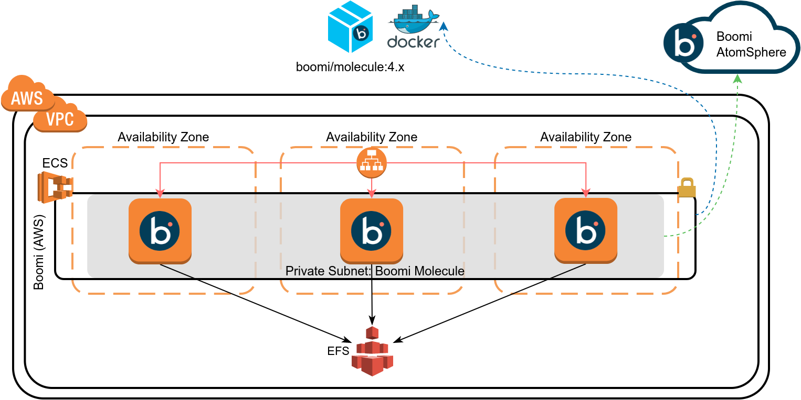
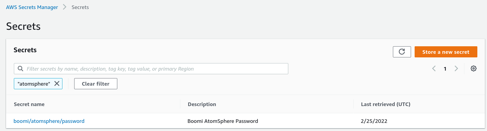
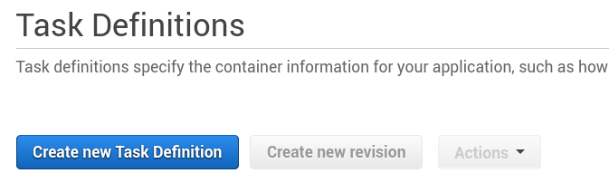
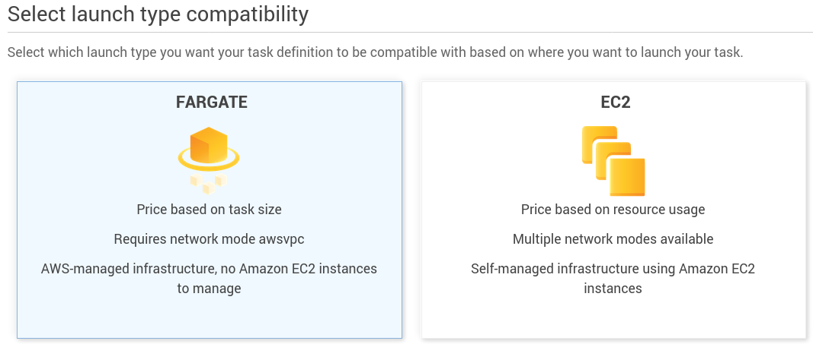
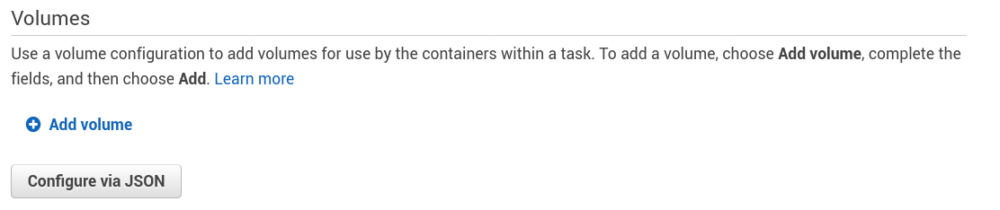
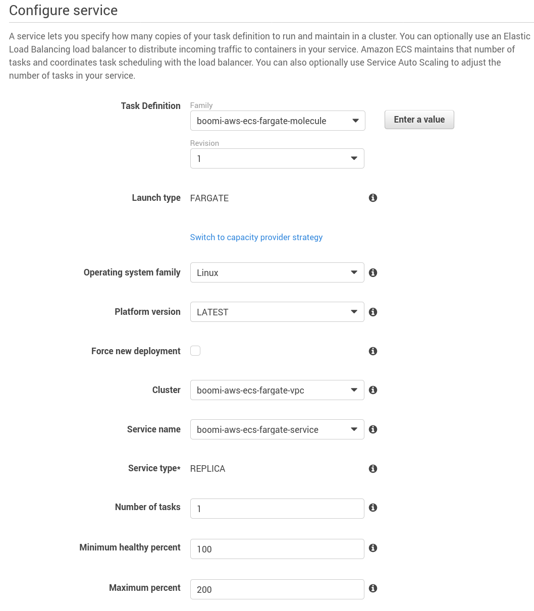
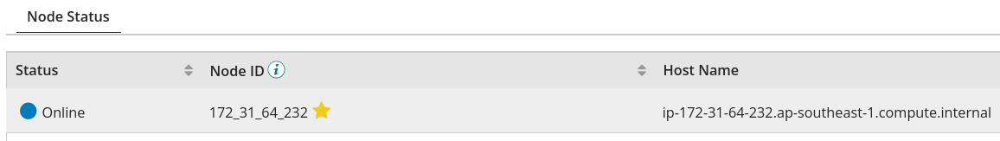
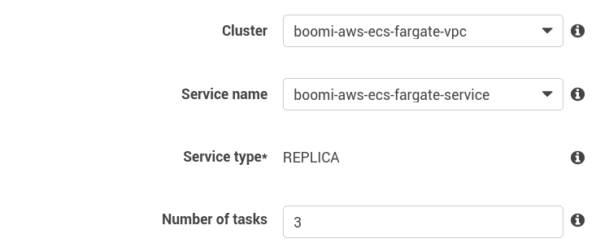
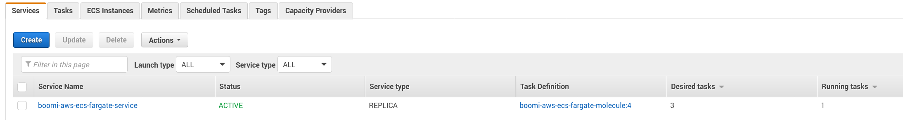
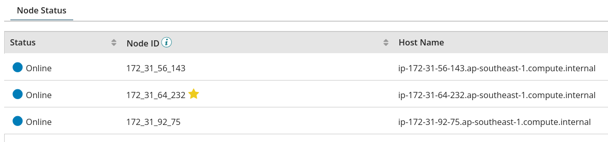

# Setup of a Boomi Molecule with multiple nodes on AWS ECS (EC2 or Fargate)



## Prerequisites

The setup of Boomi Molecule on AWS ECS requires an EFS filesystem created.

You would also need an EC2 instance with access to EFS to download some simple scripts to allow the Molecule to work:

1. connect to the ec2 instance (for instance an Amazon Linux 2 instance)

2. download the init.sh script to the root folder of the EFS filesystem: 

```
cd /mnt/efs/fs1/
wget https://raw.githubusercontent.com/anthonyrabiaza/BoomiAWSECS/master/init.sh
chmod u+x init.sh
```

Also, you need to define a secret containing the Boomi password:



Copy the Secret ARN suffix by clicking on the secret name and getting the last character following your secret name:

- For instance you might have: arn:aws:secretsmanager:ap-southeast-1:88887777666555:secret:boomi/atomsphere/password-ABcdefg
- We are interested in "ABcdefg"

## Deployment of Boomi Molecule on Kubernetes

Make sure you are using the classic version of the ECS Interface.

1. Click on “Create new Task Definition”:



2. Select EC2 or Fargate and then "Next step":



3. Scroll down to Volumes, there will be a "Configure via JSON" button, click this button:



4. Download [https://raw.githubusercontent.com/anthonyrabiaza/BoomiAWSECS/master/boomimolecule-ecs-fargate.json]

   - Update the elements wrapped with @@:
     - All the elements starting with AWS_ will be linked to your AWS Account. For instance @@AWS_ACCOUNT@@ with the AWS Account
     - All the elements starting with BOOMI_ will be linked to your Boomi Account. For instance @@BOOMI_ACCOUNTID@@ with the Boomi Account

   - Update any other required element (you can use a high value for the Boomi Molecule release, as long as it using the major version v4)
5. Paste the content of the JSON in the AWS Text area and click on "Save"
6. Validate the elements and update any other configuration
7. Click on "Create" to finalize the creation to the Task
7. Create a Service in your ECS Cluster, start with 1 task



9. Validate the creation of the Boomi Molecule

   

   - Update the Shared Web Server configuration
   - Update any other properties (this will restart the server)

10. Update the Service to have a higher number of tasks (for instance 3)



11. Wait for the creation of the additional tasks (in the following screen, we still have 2 tasks pending)



12. Validate the addition of the nodes on the Boomi Molecule


